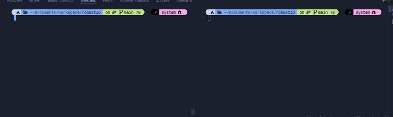

# Robust I/O

A library implementation in C for fast and efficiet I/O. It is inspired from **CSAPP**.
It takes into consideration the case of interrupt by signals.
There are 2 types of reads- buffered and unbuffered.
In many cases, we would like to avoid numerous read syscalls for retrieval of small chunk of data. This makes the program run slow. `RIO`'s buffered reads save us from those cases.

## Installation

1. Clone the repository
2. Run the following commands from the root of the repository:
```bash
$ make
$ sudo make install
```
## Usage

```c
#include "rio.h"
int main(){
    //some code
    return 0;
}
```
- compile it using the following command:
```bash
$ gcc -o <output> <filename>.c <path_to_librio.so> -I <path_to_include_dir>
$ ./<output>
```
## Performance

- The performance of the library is tested using a file with around million lines. We compare the time taken by a program using `RIO` library and a program using raw `read`s and `write`s.
- The results are as follows:



- As we can see, the program is faster when using `RIO` library as compared to raw `read` and `write` syscalls for many small reads and roughly the same for line reads.